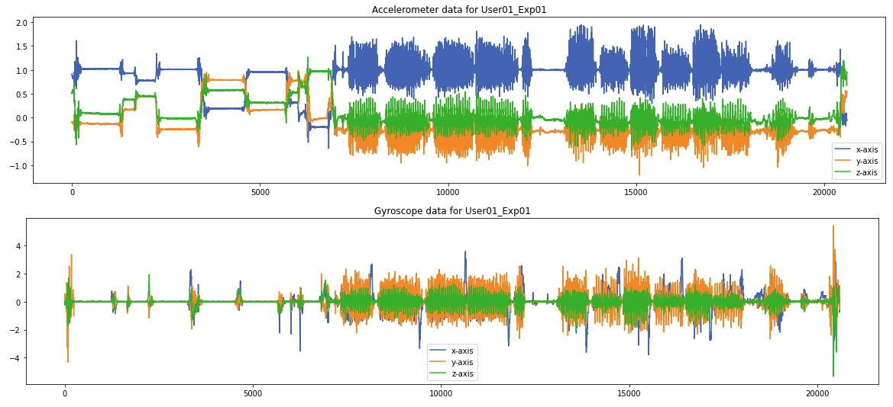
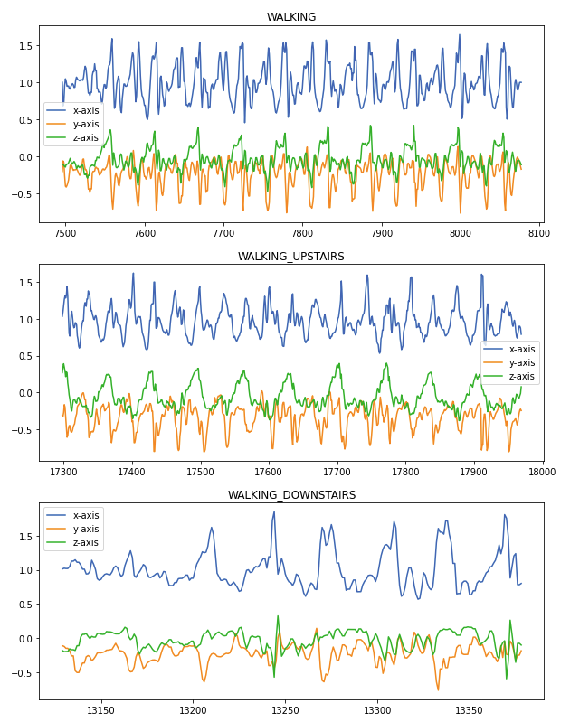
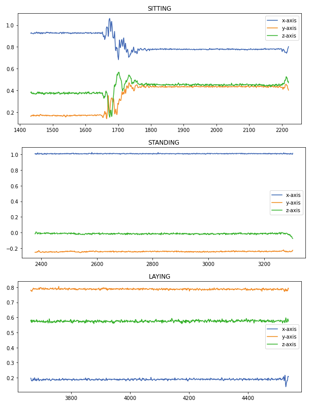
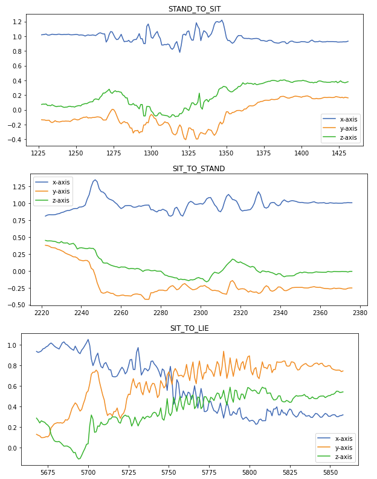
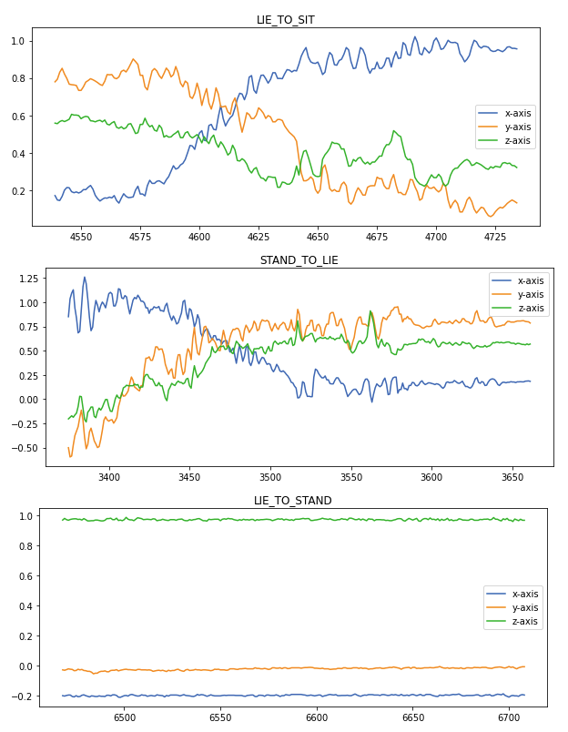

# Team05
- Swetha Lakshmana Murthy (st169481)
- Ram Sabarish Obla Amar Bapu(st169693)

Note: Temporary code changes are reflected here.
Please refer the code for the flow
Note : Please switch to the 'Integrated_Code' branch for the updated code for Diabetic Retinopathy Project(as on 22/12/2020)

# Results
# Visualization of the data
Accelerometer and Gyroscope data

Activities (Labels 1-12)

