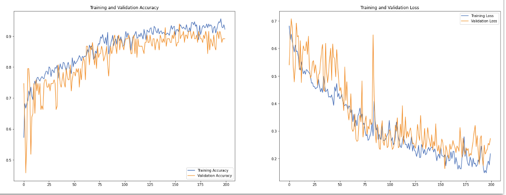
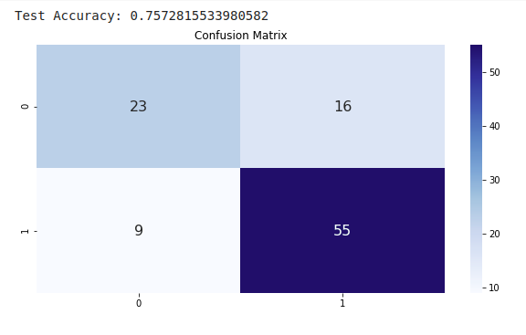
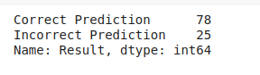

# dl-lab-2020-team05
-   Ram Sabarish Obla Amar Bapu	(st169693)		email ID:  st169693@stud.uni-stuttgart.de
-   Swetha Lakshmana Murthy 		(st169481)		email ID:  st169481@stud.uni-stuttgart.de 

# How to run the code
Run the main.py file
Here you can find different options for debugging the code. Please select the necessary option according to you choice.
Also, please make sure to enter the correct dataset directory path.

The sequence of flow is as follows:
1.	An input pipeline is set-up initially
2.	A model architecture is built
3.	Training of the model	(Also, the saved model can be found in the experiments folder)
4.	Evaluation of the model	(Test accuracy is computed here)
5.	Metrics to evaluate the model
6.	Other experimental results and logs are attached here

The tune.py file can be executed separately to configure and analyze the hyper-parameter tuning.
Please make sure to enter the correct dataset directory path.

The deep visualization is still in progress. An initial attempt in visualising the model is present in evaluation/deep visualization/ folder

# Results

The test accuracy obtained so far is 75.72%

