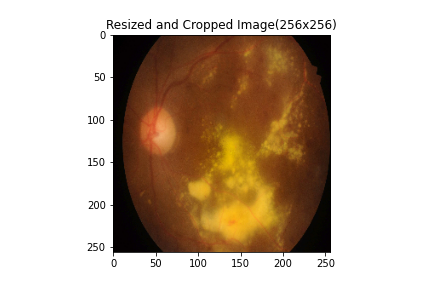
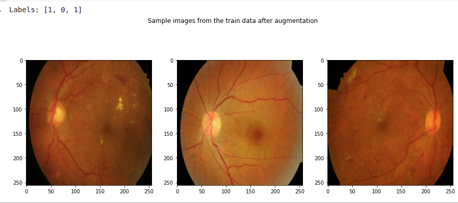

# Project 1 - Diabetic Retinopathy Detection

# Team05 
- Ram Sabarish Obla Amar Bapu (st169693@stud.uni-stuttgart.de)  
- Swetha Lakshmana Murthy     (st169481@stud.uni-stuttgart.de)  

# How to run the code
Run the **main.py** file.
Here you can find the different options for debugging the code.  
Please select the necessary option according to your choice. 
Also, please make sure to enter the correct dataset directory path.

The sequence of the codeflow is as follows:

- An input pipeline is set-up initially  
- A model architecture is built
- Training of the model (Also, the saved model can be found in the experiments folder)  
- Evaluation of the model (Test accuracy is computed here)  
- Metrics to evaluate the model  
- Other experimental results and logs are attached here  
- The **tune.py** file can be executed separately to configure and analyze the hyper-parameter tuning.

# Results

**1.  Input Pipeline**  
- Resizing the image to 256x256(img_height x img_width) without any distortion.  
- Crop the image borders  

**2.  Data Augmentation**  
Techniques used,  
- Rotation  
- Zoom  
- Shift  
- Horizontal and Vertical Flipping  

