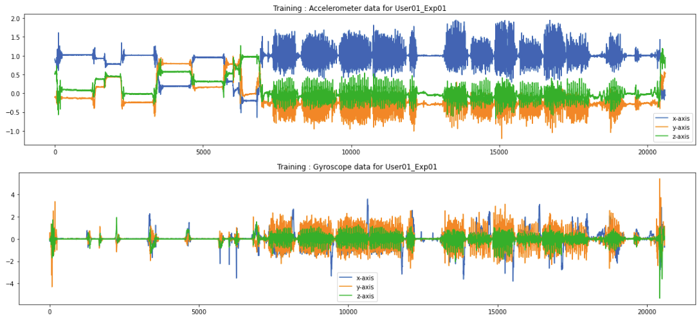
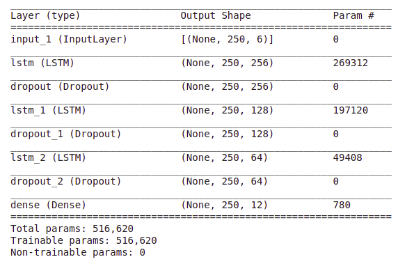
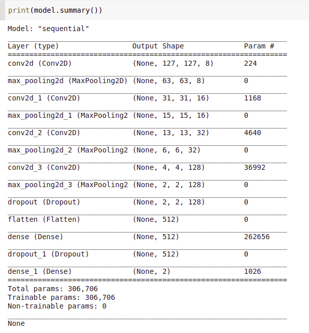

# Project 2 - Human Activity Recognition

# Team05 
- Ram Sabarish Obla Amar Bapu (st169693@stud.uni-stuttgart.de)  
- Swetha Lakshmana Murthy     (st169481@stud.uni-stuttgart.de)  

# How to run the code
Run the **main.py** file.

Here you can find the different options for debugging the code. Please select the necessary option according to your choice. 
These options enables the user for displaying the images, logs, etc..
Also, please make sure to enter the correct dataset directory path.

The sequence of the codeflow in main.py is as follows:

- An input pipeline is set-up initially  
- A model architecture is built
- Training of the model (Also, the saved model(HAR_model.h5) can be found in the experiments folder)  
- Evaluation of the model (Test accuracy is computed here)  
- Metrics - Confusion Matrix
- Other experimental results, logs and images are attached here

- The **tune.py** file can be executed separately to configure and analyze the hyper-parameter tuning.  

# Results

**--------------------------------------------------------------------**  
**The overall test accuracy obtained is 74.87%.**  
**--------------------------------------------------------------------**  

**1.  Input Pipeline **  

The following operations are performed on the input image,

- Separate the dataset into accelerometer and gyroscope  
- Visualize the data - Train and Test data  
- Visualize the 12 activities for the train data  
- Remove the noisy rows  
- Z-Score Normalization is performed on the 6 channel data(tri-axial accelerometer and tri-axial gyroscope)  
- One hot encoding of the labels - Unlabeled data is marked as 0

**Data Visualization for the training data for User01_Exp01**

**Data Visualization for the test data for User37_Exp18**

**Visualization of the 12 Activities**

**2.  Data Augmentation**

Techniques used,  
- Rotation  
- Zoom  
- Shift  
- Horizontal and Vertical Flipping  

**3. Hyperparameter Parameter Tuning using HParams**  

Hyperparameter tuning is performed to obtain a consistent model architecture,  

- HP_OPTIMIZER 
- HP_EPOCHS  
- HP_DENSE_LAYER  
- HP_DROPOUT  

|  |  |
|--------------------------------------|------------------------------------------|

**4. Model Architecture**  

The following architecture has been used, 

**Model Summary**

**5. Evaluation and Metrics**

The model is evaluated and the training and validation accuracy and loss is as shown,

**Metrics : Confusion Matrix**

**6. Deep Visualization**

The following two techniques have been used to visualize the images,  
- Grad-CAM
- Grad-CAM + Guided Backpropagation  

  

  

 
